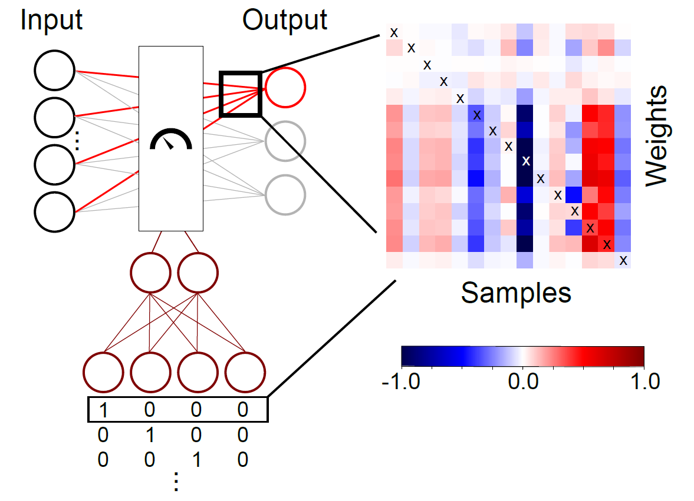

# Modulated Fully Connected Layer (MFCL)
This repository contains codes for the architecture of a modulation layer as described in the publication TBD.

Author: [Mohamed Abdelhack](https://mabdelhack.github.io/)

Current Affiliation: [Whole Person Modelling Lab](https://www.felskylab.com/), Krembil Centre for Neuroinformatics



The MFCL introduces the concept of variable weights to the fully connected layer thus enabling a compact implementation of the multiplication process.
The weights can be modulated by the modulating signal.
In this example we test modulating signals guided by missingness pattern or signal quality measures.

## Datasets

- Wisconsin breast cancer with non-random missingness: the highest quartile of each variable is removed
- OASIS3 tabular data with non-random missingness: the highest quartile of each variable is removed
- Wisconsin breast cancer data with added noise: gaussian noise with standard deviations up to 10 standard deviations of the variable values were added.

## Codes
Each experiment contains a training and testing code. 
After running the training code, you will need to get the results folder names and plug them into the test codes.
There is a training and testing codes for each dataset.
You can also modify the parameters of the model and test for yourself.

Codes for training are all prefixed with ```training_creator```.
It creates a result folder with saved models and stats from each epoch in the results folder.

Codes for testing are all prefixed with ```plot_dnn_results```.
They test for additional missingness in the test data.
Inside of that file, there is a variable ```results_location``` that you want to plug in the name of the folder containing the training results from the ```results``` folder.
This setting is to allow you to use the same code to test multiple conditions.
Testing additional missingness can be performed using three paradigms based on the value of the variable ```testing_paradigm```:

- Random removal ```random```
- Removing variables above a certain quantile ```quantile```
- Complete feature removal ```feature```

### Example:
You ran the code ```training_creator_missintro_breastcancer.py``` and it generated the folder ```breast_cancer_20221005_2224```.
Edit the ```results_location``` variable in ```plot_dnn_results_breastcancer.py``` to ```breast_cancer_20221005_2224``` and run the file to get your desired results.

The MFCL layer architecture itself is located in the ```models/layers/mlp_compensate_denselayer.py```.
The network with MFCL is located in ```models/modulate_layer_network.py```

If you have any problems with it, open an issue here on Github or contact me through the personal website above.

## Note
The code was tested on python 3.6.7 
